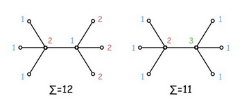

[src](https://www.facebook.com/notes/facebook-hacker-cup/hacker-cup-2015-round-1-solutions/1047761065239794)

##### Corporate Gifting

This problem is equivalent to the following graph theory formulation: given a tree T with N nodes, color the nodes with colors 1, 2, 3, ..., such that no two adjacent nodes have the same color, and that the sum of all colors is minimal. Since a tree is a bipartite graph, it can be always be colored with two colors 1 and 2, but this does not always yield the minimal solution as shown in the following simple example:

First we need to construct the adjacency lists for each node. This can be achieved by using vectors or lists in order to use O(N) memory.

Assume that the number of different colors used in the minimal solution is C. We can formulate a recursive solution (though note that this can also be computed bottom-up by removing leaves from the tree as we go).

For each node v, let f(v, c) be the minimal sum of colors in the subtree rooted at node v, given that c in {1, 2, ..., C} is the color of node v. Let v1, v2, ..., vk be the children of v. We can try any of the colors 1, 2, ..., C for the node v, and compute f(v, c) as:

f(v, c) = c + [min over c1, c1 ≠ c] f(v1, c1) + ... + [min over ck, ck ≠ c] f(vk, ck)

Therefore, direct implementation of the above method gives us a solution with time and memory complexity O(N * C2).

We can also prove that O(log N) is an upper bound for C. Let C(k) be the size of the smallest tree that needs all colors 1, 2, ..., k in an optimal coloring. Trivially, it holds that C(1) = 1 and C(2) = 2. Without loss of generality, we can pick the node with color k to be the root. In that case, the root needs to be adjacent to all colors from 1 to k-1 and we can apply the inductive hypothesis as follows: 

C(k) ≥ C(k-1) + ... + C(2) + C(1) + 1 ≥ 2k - 1 + ... + 21 + 2 + 1 = 2k.

This completes the proof. The above algorithm therefore has complexity O(N log2 N) in both time and memory. We leave the problem of constructing a minimal tree that requires k colors as an exercise for the reader.

However, there is also an algorithm with O(N) time and memory complexity. The above formula can be simplified if we just use the two best values for each node, together with the colors where these minimum values are achieved.

Let ci and di be the best and second-best colors for the node vi respectively. Now,

f(v, c) = c + [f(v1, c1) if c ≠ c1, otherwise f(v1, d1)] + ... + [f(vk, ck) if c ≠ ck, otherwise f(vk, dk)] 

This appears to still take O(C * k) time as we need to try all C colors, leading to a O(N log N) solution. However, we can improve this to O(k) time. Let B be our base cost, the minimum we must pay for the subtree rooted at v:

B = c + f(v1, c1) + ... + f(vk, ck)

Now, let Ai be the additional cost if we decide to use color i:

Ai = Σj [f(vj, dj) - f(vj, cj), where cj = i]

We can precompute A in O(k) time, and then we can get the minimum cost of coloring v's subtree in O(k) time with:

B + min (A1, ..., Ak)

And with that, our solution is now O(N)!

Input: https://www.dropbox.com/s/coz49bgunnm0b18/gifting.full.in?dl=0

Output: http://pastebin.com/xe9yFycs
